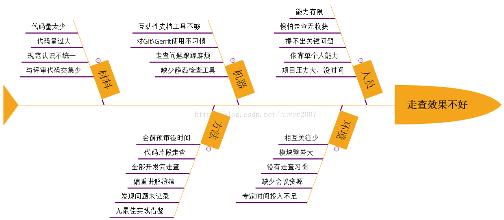

## 关于code review

参考文章：

* [如何高效迅速的进行CodeReview](https://blog.csdn.net/huver2007/article/details/75095303)

### 1、一些共性问题
* 参与人数多，意见分散，时间长，发现问题效率低；
* 参与者会觉得煎熬和浪费时间；
* 不太了解评审内容，跟不上思路；
* 代码量大，无法做到详细走查；
* 无法全员集中精神。

code review过程中出现的问题：

### 2、code review的目的及原则
***code review的目的：***
> 提升代码质量，尽早发现潜在逻辑与代码错误，降低修复成本，同时提高个人代码水平、促进团队知识分享，以及更好地理解系统。

***code review的原则：***
> * 发现代码的正确性：在代码审查中最常犯的错误是审查者根据自己的编程习惯来评判别人的代码。然而，代码审查用意是在代码提交前找到其中的问题，即发现代码的正确性。
> * 不仅是在Review Code，更是在分享和学习：Code Review最重要的是讲解者分享业务流程和设计思路，参与者通过这些讲解获得这些信息，使得更多人理解这个系统，提升团队整体水平，使得团队维护代码的能力提升。
> * 高效迅速地完成Code Review：我们不能为了应付而进行一次匆匆忙忙的代码审查，效率和效果同样重要，如果不能保证Code Review目的实现，那么评审便是徒劳的。

### 3、code review的重点

#### 3.1、检查设计的合理性和业务逻辑的正确
> 代码的设计是否符合设计要求
> 
> * 如果存在代码和设计有出入的地方需要问询为什么要变动，因为这些变动有可能是出于开发者在真正设计代码时候的深入考虑，或者是由于一时大意出现偏差。
> 
> 业务逻辑是否正确
> 
> * 业务流程是否按照详细设计的流程走，不要出现原本是先A流程后B流程而设计的时候出现先B后A，或者丢失流程。
> * 某些传入参数是否合理：判断某些接口的参数输入是否是冗余的，比如输入A字段可以满足A接口里面的所有操作，那么多输入一个B就冗余的。
> * 数据库字段的设计：数据库的设计是对实际业务的映射，我们要保证每一个字段的出现都反应实际业务并且经过合理性的验证，比如设计table1的时候A字段在table2中已经出现，并且A和B表有相应的关联，那么要注意A字段对于table1的冗余是否有合理性，如果没有合理的说服性可以去掉A，而节省对A字段的维护成本（存储空间，更新操作等）。
> * 某些判断是否合理：比如某些参数的输入金额是否可以为0的判断等等。
> * 系统交互是否合理：比如在代码设计的时候没有关注考虑系统交互的顺序而造成有些信息不能获取到；比如获取支付方式的费率信息必须要等待支付的时候才能拿到，那么获取这些信息就应该放在pay_trans的时候而不是create_trans，大多数这种问题其实都是详细设计时出现的，代码评审阶段比较少见。
> * 是否有异常处理机制，一个好的代码设计应该考虑各种异常并对相应的异常做出合理的处理，比如接口的可重入，当代码检测到有重入的这种情况，怎样去做这种异常处理使得调用方能捕捉的这些异常而进行后面的处理。
> 
> 关注业务可拓展性
>
> * 我们的业务在不断的发展，每一个项目设计都会影响后续业务的拓展，一个好的设计应该考虑到后续业务的发展，而尽量避免定制化的设计。
>
> 关注使用到的数据结构、设计模式和代码性能
>
> * 一个好的数据结构和设计模式可以增加代码的可维护性安全性和效率等，比如我们在设计的时候要考虑到不同的场景选择什么样的数据结构，有时候我们会纠结于用map还是用hash_map，这时候我们要根据具体的情况具体分析；
> * 当我们设计代码的时候如果能用上系统提供的函数那么最好不要自己去写，比如自己实现一个链表的时候是否可以想到用系统库提供的list_head以确保链表结构的正确性；
> * 某些设计如果能套用设计模式会让设计更加美观也让阅读者更加明了；出于对系统性能的考量，我们要关注编写代码对系统的开销，包括使用的算法是否合理，以及对某些比较耗时的操作比如数据库的操作要加以关注。

#### 3.2、检查代码可读性和可维护性：
> * 如果代码的可读性强，那么维护起来也就方便很多；一个好的代码规范和编码风格会节省大家对代码的理解时间，减少维护成本；虽然我们有编程规范检查工具，但有些内容检查不出来，是需要靠大家去规范的。
> * 关注代码注释：我们在编写函数和进行逻辑判断的时候最好要标注一下这个函数或者这段判断是用来做什么的；做了这种注释的好处，一来当别人阅读这段代码的时候看到你的注释以后就会根据你的思路快速理解代码，甚至不阅读直接跳过；二来防止自己由于长时间不阅读代码而忘记这段代码的用途。
> * 关注命名规范：虽然我们有自己的编码规范，但是这种规范只是限制了使用驼峰命名法还是其他命名法；而好的命名风格应该是看到变量或者函数名字就能“望文生义”，毕竟我们不能把自己写的所有代码都做注释。
> * 关注重复代码：如果出现大量的重复性代码，要考虑将这些代码抽象出公用函数，以减少代码量并增强代码可读性。
> * 关注繁琐的逻辑：如果一个简单的功能却对应大篇幅的代码，要考虑一下是不是有比较简单的实现方式，因为过于复杂的代码会给后来者的维护带来麻烦；如果没有简略的办法，一定要把注释写好。

#### 3.3、分享设计、技术、知识和经验
> * 在代码审查的过程中，大家往往把关注点放在发现代码的不足上，忽略了代码评审过程中的设计思想、技术方法、业务知识的传播，我觉得这些内容也是非常重要的，也需要同时关注。
> * 评审者在自己的代码时会深入业务流程，参与这可以看到评审代码的一些算法、数据结构、设计模式甚至是系统架构等知识以及评审者在编码过程中踩过的坑；通过这些信息参与者可以提升自己的业务水平和技术能力使得整个团队的水平得到提高。
> * 参与者除了要有这种学习意识外，评审者也要想办法让参与者更加快速高效的去理解代码中传播的知识，这样能帮助提升Review速度，所以建议评审者能简单介绍一下项目的背景以及详细设计，这些信息的介绍有以下好处：
	* 首先，代码的设计是按照详细设计来执行的，但是设计者在真正code的时候会出现一些变动，这些变动要给大家一个同步；
	* 其次，参与过详细设计的人可能由于没有直接参与的code，时间长会忘记之前详细设计的流程，简单介绍之后就会让参与者想起，方便参与者的理解；
	* 第三，对于没参与详细设计的同学，在简单介绍过这些信息后，可以有个大致了解，不然整个评审过程会很煎熬；

> 所以，如果参与者对代码的信息不理解，会造成参与者理解代码的难度，也就不能提出有建设性的意见，同时也难以学到评审中传播的知识；这一点在之前的评审中是比较容易被大家忽略的，尤其是在跨团队代码评审时，准备不足和经验不足的同学是很难理解对方在讲什么的。
> 
> * 讲解code的时候最好是以接口功能为单位去讲解
	* 如果评审者一下子把所有的详细设计都讲解完，可能会因为信息量比较大，或者设计到一些细节问题，参与者不能有效的记住或理解也会影响评审的速度和效率；
	* 评审者可以在讲解的过程中分享一下自己踩过的坑，参与者可以随时根据自己发现的问题进行讨论。
	
### 4、如何迅速完成Code Review？
> 所谓的迅速就是节省时间，只要我们尽量避免一些意义不大的事情就能节省时间，加快评审速度，要做到这点建议大家尽量不要做以下这些事情：
>
> 1.不要刻意地去寻找代码bug
>
> 有些代码的逻辑是比较复杂的，如果是很容易就发现的缺陷，大多数情况下评审者自己在编码过程就会发现，那么剩下不容易发现的缺陷要发现也会花费较多的时间，这些问题可以交给测试人员去发现；
>
> 如果参与者刻意去找bug会造成顾此失彼，忽略更重要的东西；当然，有些bug你可能一眼就看出来了，那提出来就再好不过了。
>
> * 2.不要按照自己的编程风格去评论别人的代码
>
> 有些人参与者比较自信，对自己写得代码感觉很满意，所以有时候就会根据自己熟悉的编码语言或者编码风格去评论别人的代码；
>
> 作为参与者，只要觉得评审者的代码符合命名要求和设计要求就可以了，但假如评审者的代码缺陷很明显，可以提出带大家进行讨论。
>
> * 3.不要带着抨击和质疑别人能力的心态去进行代码评审
>
> 有时候参与者可能心情不好，或者感觉对方是新人就忍不住会抨击对方的代码，这样会比较容易在模棱两可的问题上浪费时间；
>
> 参与者可能认为A方法好，评审者可能认为B方法也不坏，这样就会造成没有必要的争论而浪费时间。
>
> * 4.不要在不确定的问题上争来争去
>
> 大家在讨论的时候如果某些问题讨论一段时间以后仍然没有结论，或者需要第三方确认或者评审者不能马上理解参与者提出的意见时，不要花太多时间讨论这些问题；
>
> 把这些问题先记录下来，等会议结束后评审者可以与参与者进行线下讨论，同时将这些问题根据自己的理解进行解决，之后给大家一个反馈即可，这样可以节省很多时间。
>
> * 5.不要听不进别人的意见
>
> 有些评审者比较固执，不愿意接受大家的意见，会造成一些不必要的争端和讨论，浪费时间；
>
> 当然，有时候参与者的意见不见得是最好的，作为评审者将其作为一个参照的方向和视角，如果存在争论，这些建议也可以做成会议记录，评审者私下和建议提出者讨论以后给大家一个结论。
>
> * 6.参与者最好不要自己都没想明白就提意见
>
> 如果参与者自己没有想明白的事情就去提意见，那么评审者反问的时候会浪费大家的时间；
>
> 参与者可以先将自己的想法大致记下来，自己想清楚了之后再提给评审者也是节省时间的办法。
>
> * 7.评审前最好先通过代码静态检查工具检测
> 
> 一般规范性的问题都可以通过静态检测工具发现，借助工具是最省事，也是效率最高的，还可以避免大家都评审时提出很多规范性问题，而遗漏了业务逻辑、设计合理性等问题。

### 5、代码规范检查工具

#### 5.1 python
* [使用pycharm和pylint检查python代码规范](https://blog.csdn.net/suzyu12345/article/details/80323067)

#### 5.2 c++
* [Google代码规范工具Cpplint的使用](http://www.cnblogs.com/zhuyijie/p/6464677.html)

#### 5.3 java
* [阿里代码规范检查工具的安装使用](https://www.cnblogs.com/chenjfblog/p/7685579.html)

### 6、代码静态检查工具

#### 6.1 什么是静态代码分析
【定义参考：[常用 Java 静态代码分析工具的分析与比较](https://www.cnblogs.com/westward/p/5084308.html)】
静态代码分析是指无需运行被测代码，仅通过分析或检查源程序的语法、结构、过程、接口等来检查程序的正确性，找出代码隐藏的错误和缺陷，如参数不匹配，有歧义的嵌套语句，错误的递归，非法计算，可能出现的空指针引用等等。

在软件开发过程中，静态代码分析往往先于动态测试之前进行，同时也可以作为制定动态测试用例的参考。统计证明，在整个软件开发生命周期中，30% 至 70% 的代码逻辑设计和编码缺陷是可以通过静态代码分析来发现和修复的。

但是，由于静态代码分析往往要求大量的时间消耗和相关知识的积累，因此对于软件开发团队来说，使用静态代码分析工具自动化执行代码检查和分析，能够极大地提高软件可靠性并节省软件开发和测试成本。

#### 6.2 java
* [常用 Java 静态代码分析工具的分析与比较](https://www.cnblogs.com/westward/p/5084308.html)

#### 6.3 python
* 同5.1 [使用pycharm和pylint检查python代码规范](https://blog.csdn.net/suzyu12345/article/details/80323067)

#### 6.4 c++
* [静态代码分析工具大比拼（C++篇）](https://blog.csdn.net/lovespring116/article/details/73504190)

### 7、code review工具
* [17款code review工具](https://www.cnblogs.com/code-style/p/4409264.html)

 

