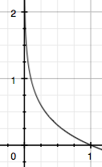

# <center> 交叉熵损失函数 </center>


# 好文推荐

* [《神经网络和深度学习》系列文章二十：交叉熵损失函数](https://mp.weixin.qq.com/s?__biz=MzIxMjAzNDY5Mg==&mid=402143013&idx=2&sn=2f9cb239c4a2c0c42364bc712c6111c3&mpshare=1&scene=1&srcid=1024nc8QOmOCR03iwwm6gkCz&key=c5e6aaaa5d1e2425be7c9579461e04c2bb3bfe76163163ce35f37e09a8d95f14e61b819e624e13428412b2f387a7f815cc42d38746f0e749231e47b8f6bfd61342915fb85fd895fded7a3516667dabc0&ascene=0&uin=MjI4NTQ3OTAyNA%3D%3D&devicetype=iMac+MacBookPro11%2C4+OSX+OSX+10.12+build(16A323)&version=12020010&nettype=WIFI&fontScale=100&pass_ticket=Blh6nShho4Ov8vKq9SZvMVOWpxG7M6k7uSeEQCL3kIVSF5fmEarNw%2Bna0RSI7ISq)
* [TensorFlow四种Cross Entropy算法实现和应用](https://www.jianshu.com/p/75f7e60dae95)
* [交叉熵](https://blog.csdn.net/tsyccnh/article/details/79163834)

# 1、交叉熵
交叉熵（cross entropy）是深度学习中常用的一个概念，一般用来求目标与预测值之间的差距。然而，交叉熵是信息论中的一个概念，要想了解交叉熵的本质，需要先从最基本的概念讲起。
### 1.1 信息量
假设我们听到了两件事，分别如下：
 
* 事件A：巴西队进入了2018世界杯决赛圈。 
* 事件B：中国队进入了2018世界杯决赛圈。
 
仅凭直觉来说，显而易见事件B的信息量比事件A的信息量要大。究其原因，是因为事件A发生的概率很大，事件B发生的概率很小。所以当越不可能的事件发生了，我们获取到的信息量就越大。越可能发生的事件发生了，我们获取到的信息量就越小。那么信息量应该和事件发生的概率有关。

假设 $x$ 是一个离散型随机变量，其取值集合为$X$,概率分布函数 $p(x)=Pr(x),x∈X$ 则定义事件$X=x_0$的信息量为：$$I(x_0)=−\log{p(x_0)}$$
由于是概率所以 $p(x0)$ 的取值范围是$[0,1]$,绘制为图形如下：<center></center>
### 1.2 熵
熵代表的是随机变量或整个系统的不确定性，熵越大，随机变量或系统的不确定性就越大。

考虑一个问题，对于某个事件，有$n$种可能性，每一种可能性都有一个概率 $p(x_i)$ 这样就可以计算出某一种可能性的信息量。举一个例子，假设你拿出了你的电脑，按下开关，会有三种可能性，下表列出了每一种可能的概率及其对应的信息量:

序号   |        事件      |       概率     |        信息量 $I$       |
------|------------------|---------------|------------------------|
  A   |     电脑正常开机   |      0.7      |  $-\ln{p(A)}=0.36$    |
  B   |     电脑无法开机   |      0.2      |  $-\ln{p(B)}=1.61$    |
  C   |     电脑爆炸了     |      0.1      |  $-\ln{p(C)}=2.30$    |
 
那熵是什么呢？熵用来表示信息量的期望，即：$$H(X)=-\sum_{i=1}^n{p({x_i})\ln{p({x_i})}}, \ 其中\ n\ 表示所有的可能性$$
所以电脑开机问题的熵为：
$$
\begin{align}
H(X) &=−[p(A)\log(p(A))+p(B)\log(p(B))+p(C))\log(p(C))] \\
&=0.7×0.36+0.2×1.61+0.1×2.30 \\
&=0.804
\end{align}
$$
### 1.3 相对熵
相对熵又称KL散度,如果我们对于同一个随机变量 $x$ 有两个单独的概率分布 $P(x)$ 和 $Q(x)$，我们可以使用 KL 散度（Kullback-Leibler (KL) divergence）来衡量这两个分布的差异。

维基百科中关于相对熵的定义：
> In the context of machine learning, DKL(P‖Q) is often called the information gain achieved if P is used instead of Q.
> 
> 即如果用P来描述目标问题，而不是用Q来描述目标问题，得到的信息增量。

在机器学习中，$P$往往用来表示样本的真实分布，比如$[1,0,0]$表示当前样本属于第一类。$Q$ 用来表示模型所预测的分布，比如$[0.7,0.2,0.1]$。

直观的理解就是如果用$P$来描述样本，那么就非常完美。而用$Q$来描述样本，虽然可以大致描述，但是不是那么的完美，信息量不足，需要额外的一些“信息增量”才能达到和$P$一样完美的描述。如果我们的$Q$通过反复训练，也能完美的描述样本，那么就不再需要额外的“信息增量”，$Q$等价于$P$。

KL散度的计算公式为：$$D_{KL}(p||q)=\sum_{i=1}^np(x_i)\log(\frac{p(x_i)}{q(x_i)}),\ n\ 表示所有的可能性$$
$D_{KL}$ 的值越小，表示$p$和$q$的分布约接近。

### 1.4 交叉熵
交叉熵用来衡量在给定的真实分布下，使用非真实分布所指定的策略消除系统的不确定性所需要付出成本的大小。

对KL散度的公式进行变形：
$$
\begin{align}
D_{KL}(p||q)
&= \sum_{i=1}^np(x_i)\log(\frac{p(x_i)}{q(x_i)}) \\
&= \sum_{i=1}^np(x_i)\log(p(x_i)) - \sum_{i=1}^np(x_i)\log(q(x_i)) \\
&= -H(p(x)) + [- \sum_{i=1}^np(x_i)\log(q(x_i))]
\end{align}
$$
等式的前面部分恰好是$p$的熵，等式的后一部分，就是交叉熵：
$$
H(p, q) = - \sum_{i=1}^np(x_i)\log(q(x_i))
$$

**特别的，在机器学习中，我们需要评估lable和predicts之间的差距，使用KL散度刚刚好，即$D_{KL}(y||\hat{y\ })$**。由于KL散度中的前一部分$-H(X)$不变，故在优化过程中，只需要关注交叉熵即可。所以一般在机器学习中直接用交叉熵作为loss函数来评估模型。

  
# 2、交叉熵的使用
### 2.1 <span id="single_object_cross_entropy">交叉熵在单问题目标中的使用</span>
这里的单目标问题指的是预测结果中只能属于一个类别，lable为one-hot形式，例如一张样本图片只属于一个类别，只能是猫或者是狗或者是猪。模型的输出大多选择softmax函数作为激活函数，这样可以使预测值之和等于1。

在单分类问题中，交叉熵损失函数为：$$Loss=-\sum_{i=1}^ny_i\log{(\hat{y_i})}$$上式中$n$代表类别的数量。

例如：
<center>

    *     |        猫      |     狗     |    猪      |
----------|--------------- |-----------|------------|
  label   |     0          |      1    |       0    |
  pred    |     0.3        |      0.6  |      0.1   |
</center>
那么：
$$
\begin{align}
loss &= -\frac{1}{m}\sum_{j=1}^{m}\sum_{i=1}^{n}y_{ji}\log(\hat{(y_{ji})}) \\
     &= -\frac{1}{1}[0*\log{(0.3)} + 1*\log{(0.6)} + 0*\log{(0.1)}] \\
&= -\log(0.6)
\end{align}
$$
m 表示一个batch的样本数量，即batch_size值，n表示类别数量。
 
### 2.2 <span id="multi_object_cross_entropy">交叉熵在多目标问题中的使用</span>
这里的多目标问题指的是预测结果可以属于一个或者多个类别，label是n-hot形式，例如一张样本图片可以同时包含猫和狗。

例如：
<center>

    *     |        猫      |     狗     |    猪      |
----------|--------------- |-----------|------------|
  label   |     0          |      1    |       1    |
  pred    |     0.1        |      0.7  |      0.8   |
</center>
值得注意的是，这里的预测不再是通过softmax计算得到的，通常采用sigmoid形式，将每一个节点都归一化到[0, 1]之间，所有的预测值之和不再等于1。话句话说，每一个节点都是独立同分布的，相互之间不再有影响，所以交叉熵需要对每一个节点进行计算，所以：
$$
\begin{align}
loss = -\frac{1}{m}\sum_{j=1}^{m}\sum_{i=1}^{n}y_{ji}\log{(\hat{y_{ji}})} + (1-y_{ji}\log(1-\hat{y_{ji}}))\\
\end{align}
$$

# 3、为什么使用交叉熵作为loss函数
参考：Michael Nielsen的《Neural Network and Deep Learning》关于改进神经网络的学习方法中交叉熵损失函数

* 非负；
* 当实际输出越接近理想输出的时候，loss越接近于0。
* **使用交叉熵作为损失函数的一大优势是模型误差越大，模型的学习速率越大；**

# 4、tensorflow交叉熵的实现和应用
TensorFlow针对分类问题，实现了四个交叉熵函数，分别是：

* `tf.nn.sigmoid_cross_entropy_with_logits`
* `tf.nn.softmax_cross_entropy_with_logits`
* `tf.nn.sparse_softmax_cross_entropy_with_logits`
* `tf.nn.weighted_cross_entropy_with_logits`

TensorFlow目前提供的有关Cross Entropy的函数实现，用户需要理解**多目标**和**多分类**的场景，根据业务需求（分类目标是否独立和互斥）来选择基于sigmoid或者softmax的实现，如果使用sigmoid目前还支持加权的实现，如果使用softmax我们可以自己做onehot encoding或者使用更易用的sparse_softmax_cross_entropy_with_logits函数。

TensorFlow提供的Cross Entropy函数基本涵盖了多目标和多分类的问题，但如果同时是多目标多分类的场景，肯定是无法使用softmax_cross_entropy_with_logits，如果使用sigmoid_cross_entropy_with_logits我们就把多分类的特征都认为是独立的特征，而实际上他们有且只有一个为1的非独立特征，计算Loss时不如Softmax有效。

### 4.1 `sigmoid_cross_entropy_with_logits`
我们先看`sigmoid_cross_entropy_with_logits`，为什么呢，因为它的实现和交叉熵的定义是一样的，也是TensorFlow最早实现的交叉熵算法。这个函数的输入是logits和targets，logits就是神经网络模型中的 $W * X$ 矩阵，**<font size=4>注意不需要经过sigmoid</font>**，而targets的shape和logits相同，就是正确的label值，例如这个模型一次要判断100张图是否包含10种动物，这两个输入的shape都是[100, 10]。

> 注释中还提到这10个分类之间是独立的、不要求是互斥，这种问题我们称之为多目标问题，例如判断图片中是否包含10种动物，label值可以包含多个1或0个1。还有一种问题是多分类问题，例如我们对年龄特征分为5段，只允许5个值有且只有1个值为1，这种问题可以直接用这个函数吗？答案是不可以！
>请参考：[2.2 交叉熵在多目标问题中的使用](#multi_object_cross_entropy)

我们先来看看`sigmoid_cross_entropy_with_logits`的代码实现：

```
For brevity, let `x = logits`, `z = labels`.  The logistic loss is

z * -log(sigmoid(x)) + (1 - z) * -log(1 - sigmoid(x))
= z * -log(1 / (1 + exp(-x))) + (1 - z) * -log(exp(-x) / (1 + exp(-x)))
= z * log(1 + exp(-x)) + (1 - z) * (-log(exp(-x)) + log(1 + exp(-x)))
= z * log(1 + exp(-x)) + (1 - z) * (x + log(1 + exp(-x))
= (1 - z) * x + log(1 + exp(-x))
= x - x * z + log(1 + exp(-x))
```
可以看到这就是标准的Cross Entropy算法实现，对 $W * X$ 得到的值进行sigmoid激活，保证取值在0到1之间，然后放在交叉熵的函数中计算Loss。对于二分类问题这样做没问题，但对于前面提到的多分类，例如年轻取值范围在[0, 4]，目标值也在[0, 4]，这里如果经过sigmoid后预测值就限制在0到1之间，而且公式中的$1 – z$就会出现负数，仔细想一下0到4之间还不存在线性关系，如果直接把label值带入计算肯定会有非常大的误差。因此对于多分类问题是不能直接代入的，那其实我们可以灵活变通，把5个年龄段的预测用one-hot encoding变成5维的label，训练时当做5个不同的目标来训练即可，但不保证只有一个为1，对于这类问题TensorFlow又提供了基于Softmax的交叉熵函数。

### 4.2 `softmax_cross_entropy_with_logits`
​`softmax_cross_entropy_with_logits`和`sigmoid_cross_entropy_with_logits`很不一样，输入是类似的，logits和lables的shape一样，但这里要求分类的结果是互斥的，保证只有一个字段有值，例如CIFAR-10中图片只能分一类而不像前面判断是否包含多类动物。【请参考[2.1 交叉熵在单问题目标中的使用](#single_object_cross_entropy)】

​什么会有这样的限制？在函数头的注释中我们看到，这个函数传入的logits是unscaled的，既不做sigmoid也不做softmax，因为函数实现会在内部更高效得使用softmax，对于任意的输入经过softmax都会变成和为1的概率预测值，这个值就可以代入变形的Cross Entroy公式$- y * ln(a) – (1 – y) * ln(1 – a)$中，得到有意义的Loss值了。如果是多目标问题，经过softmax就不会得到多个和为1的概率，而且label有多个1也无法计算交叉熵，因此这个函数只适合单目标的二分类或者多分类问题。

TensorFlow函数定义如下：
> Measures the probability error in discrete classification tasks in which the classes are mutually exclusive (each entry is in exactly one class).  For example, each CIFAR-10 image is labeled with one and only one label: an image can be a dog or a truck, but not both.
>
> NOTE:  While the classes are mutually exclusive, their probabilities need not be.  All that is required is that each row of labels is a valid probability distribution.  If they are not, the computation of the gradient will be incorrect.

再补充一点，对于多分类问题，例如我们的年龄分为5类，并且人工编码为0、1、2、3、4，因为输出值是5维的特征，因此我们需要人工做one-hot encoding分别编码为[0, 0, 0, 0, 1]、[0, 0, 0, 1, 0]、[0, 0, 1, 0, 0]、[0, 1, 0, 0, 0]、[1, 0, 0, 0, 0]，才可以作为这个函数的输入。理论上我们不做one-hot encoding也可以，做成和为1的概率分布也可以，但需要保证是和为1，和不为1的实际含义不明确，TensorFlow的C++代码实现计划检查这些参数，可以提前提醒用户避免误用。

### 4.3 `sparse_softmax_cross_entropy_with_logits`
`sparse_softmax_cross_entropy_with_logits`是`softmax_cross_entropy_with_logits`的易用版本，除了输入参数不同，作用和算法实现都是一样的。前面提到`softmax_cross_entropy_with_logits`的输入必须是类似one-hot encoding的多维特征，但CIFAR-10、ImageNet和大部分分类场景都只有一个分类目标，label值都是从0编码的整数，每次转成one-hot encoding比较麻烦，有没有更好的方法呢？

答案就是用`sparse_softmax_cross_entropy_with_logits`，它的第一个参数logits和前面一样，shape是[batch_size, num_classes]，而第二个参数labels以前也必须是[batch_size, num_classes]否则无法做Cross Entropy，这个函数改为限制更强的[batch_size]，而值必须是从0开始编码的int32或int64，而且值范围是[0, num_class)，如果我们从1开始编码或者步长大于1，会导致某些label值超过这个范围，代码会直接报错退出。这也很好理解，TensorFlow通过这样的限制才能知道用户传入的3、6或者9对应是哪个class，最后可以在内部高效实现类似的one-hot encoding，这只是简化用户的输入而已，如果用户已经做了one-hot encoding那可以直接使用不带“sparse”的`softmax_cross_entropy_with_logits`函数。

### 4.4 `weighted_sigmoid_cross_entropy_with_logits`
`weighted_sigmoid_cross_entropy_with_logits`是`sigmoid_cross_entropy_with_logits`的拓展版，输入参数和实现和后者差不多，可以多支持一个pos_weight参数，目的是可以增加或者减小正样本在算Cross Entropy时的Loss。实现原理很简单，在传统基于sigmoid的交叉熵算法上，正样本算出的值乘以某个系数接口，算法实现如下：

```
This is like `sigmoid_cross_entropy_with_logits()` except that `pos_weight`, 
allows one to trade off recall and precision by up- or down-weighting the
cost of a positive error relative to a negative error.

The usual cross-entropy cost is defined as:

  targets * -log(sigmoid(logits)) + (1 - targets) * -log(1 - sigmoid(logits))

A value `pos_weights > 1` decreases the false negative count, hence increasing
the recall.
Conversely setting `pos_weights < 1` decreases the false positive count and
increases the precision.
This can be seen from the fact that `pos_weight` is introduced as a
multiplicative coefficient for the positive targets term
in the loss expression:

  targets * -log(sigmoid(logits)) * pos_weight +
      (1 - targets) * -log(1 - sigmoid(logits))

For brevity, let `x = logits`, `z = targets`, `q = pos_weight`.
The loss is:

    qz * -log(sigmoid(x)) + (1 - z) * -log(1 - sigmoid(x))
  = qz * -log(1 / (1 + exp(-x))) + (1 - z) * -log(exp(-x) / (1 + exp(-x)))
  = qz * log(1 + exp(-x)) + (1 - z) * (-log(exp(-x)) + log(1 + exp(-x)))
  = qz * log(1 + exp(-x)) + (1 - z) * (x + log(1 + exp(-x))
  = (1 - z) * x + (qz +  1 - z) * log(1 + exp(-x))
  = (1 - z) * x + (1 + (q - 1) * z) * log(1 + exp(-x))

Setting `l = (1 + (q - 1) * z)`, to ensure stability and avoid overflow,
the implementation uses

  (1 - z) * x + l * (log(1 + exp(-abs(x))) + max(-x, 0))

`logits` and `targets` must have the same type and shape.`

```

# 5 Keras交叉熵的实现和应用
参考：[交叉熵在tf和keras上的实现](https://www.cnblogs.com/hutao722/p/9761387.html)

### 5.1 binary_crossentropy
keras中的binary_crossentropy，用途与4.1中的sigmoid_cross_entropy_with_logits是一样的，但两者有差别：
> sigmoid_cross_entropy_with_logits还原了预计值和输出值在数学公式中的差值，但不是一种概率差，输出值和预计值明明一样，概率差应该为0，但结果却不是0。
> 
>而binary_crossentropy则先把输出值进行概率包装后，再带入sigmoid_cross_entropy_with_logits数学公式中。

例如：

```
import keras.backend as K
from tensorflow.python.ops import math_ops
from tensorflow.python.ops import clip_ops
from tensorflow.python.framework import ops

y_target = K.constant(value=[1])
y_output = K.constant(value=[1])
print("y_target: ", K.eval(y_target))
print("y_output: ", K.eval(y_output))

epsilon_ = ops.convert_to_tensor(K.epsilon(), y_output.dtype.base_dtype)
print("epsilon: ", K.eval(epsilon_))
output = clip_ops.clip_by_value(y_output, epsilon_, 1 - epsilon_)
print("output: ", K.eval(output))
output = math_ops.log(output / (1 - output))
print("output: ", K.eval(output))

print("the loss is: ", K.eval(nn.sigmoid_cross_entropy_with_logits(labels=y_target, logits=output)))
print(K.eval(keras.losses.binary_crossentropy(y_target, y_output)))
```
输出结果为：

```
y_target:  [1.] 
y_output:  [1.]
epsilon:  1e-07
output:  [0.9999999]
output:  [15.942385]
the loss is:  [1.1920933e-07]
1.1920933e-07
```
最后的结果1.1920933e-07相当于0.00000012，符合我们对预测值和输出值差别不大的认知。因此可以理解keras的损失函数输出值更加人性化。

### 5.2 categorical_crossentropy
在keras中，`categorical_crossentropy`与tensorflow中的`softmax_cross_entropy_with_logits_v2`对应，采用的算法和上述基本一致，只是需要把y_output按分类值做概率转换。

例如：

```
import keras.backend as K
from tensorflow.python.ops import nn
from tensorflow.python.ops import math_ops
from tensorflow.python.ops import clip_ops
from tensorflow.python.framework import ops
import keras

y_target = K.constant(value=[1, 2])
y_output = K.constant(value=[1, 2])
print("y_target: ", K.eval(y_target))
print("y_output: ", K.eval(y_output))

output = y_output / math_ops.reduce_sum(y_output, -1, True)
print("output: ", K.eval(output))
epsilon_ = ops.convert_to_tensor(K.epsilon(), output.dtype.base_dtype)
output = clip_ops.clip_by_value(output, epsilon_, 1. - epsilon_)
print("output: ", K.eval(output))
print("the loss is: ", K.eval(-math_ops.reduce_sum(y_target * math_ops.log(output), -1)))
print(K.eval(nn.softmax_cross_entropy_with_logits_v2(labels=y_target, logits=y_output)))
print(K.eval(keras.losses.categorical_crossentropy(y_target, y_output)))
```
输出结果为：

```
('y_target: ', array([1., 2.], dtype=float32))
('y_output: ', array([1., 2.], dtype=float32))
('output: ', array([0.33333334, 0.6666667 ], dtype=float32))
('output: ', array([0.33333334, 0.6666667 ], dtype=float32))
('the loss is: ', 1.9095424)
1.939785
1.9095424
```
说明：y_output有两个输出值1和2，通过softmax函数转化后，我们可知1的对应softmax值为0.268941422，而2的对应softmax值为0.731058581；同时1对应的预测值为1,2对应的预测值为2。将上述值带入公式验证：


$$
\begin{align}
L &= -\sum{(y * \ln{a})} \\
&= -(1 * \ln{(\frac{e}{(e + e^2)})} -(2 * ln{ (\frac{e^2}{(e + e^2)})} \\
&= -(1 * \ln{0.268941422}) -(2 * \ln{0.731058581}) \\
&= 1.939785
\end{align}
$$

### 5.3 `sparse_categorical_crossentropy`
该函数对应tensorflow的`sparse_softmax_cross_entropy_with_logits`，最大的不同在于：

* 1. 其参数y_output被设定为经过softmax之后的值；
* 2. y_output还会被log处理下

例如：

```
import keras.backend as K
from tensorflow.python.ops import nn

y_target = K.constant(value=1, dtype='int32')
y_output = K.constant(value=[1, 2])
print("y_target: ", K.eval(y_target))
print("y_output: ", K.eval(y_output))

print("the loss is: ", K.eval(nn.sparse_softmax_cross_entropy_with_logits(labels=y_target, logits=y_output)))

y_target = K.constant(value=1, dtype='int32')
y_output = K.constant(value=[0.2, 0.2, 0.6])
print("y_target: ", K.eval(y_target))
print("y_output: ", K.eval(y_output))

print("the loss is: ", K.eval(K.sparse_categorical_crossentropy(y_target, y_output)))
```
结果输出为：

```
('y_target: ', 1)
('y_output: ', array([1., 2.], dtype=float32))
('the loss is: ', 0.31326166)
('y_target: ', 1)
('y_output: ', array([0.2, 0.2, 0.6], dtype=float32))
('the loss is: ', array([1.609438], dtype=float32))
```
计算过程分别是：

`sparse_softmax_cross_entropy_with_logits`：
$$
a = \frac{e^2}{(e + e^2)} = 0.731058581 \\
L = -\ln{a} = 0.313261684
$$

`sparse_categorical_crossentropy`:
$$
a = e^{ln0.2}/(e^{ln0.2} + e^{ln0.2} + e^{ln0.6}) = 0.2/(0.2 + 0.2 +0.6) = 0.2 \\
L = -ln0.2 = 1.609438
$$


