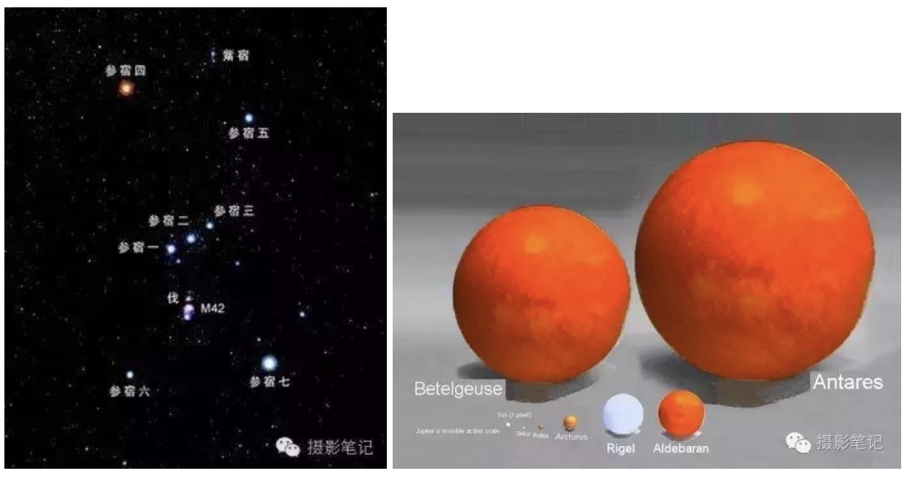
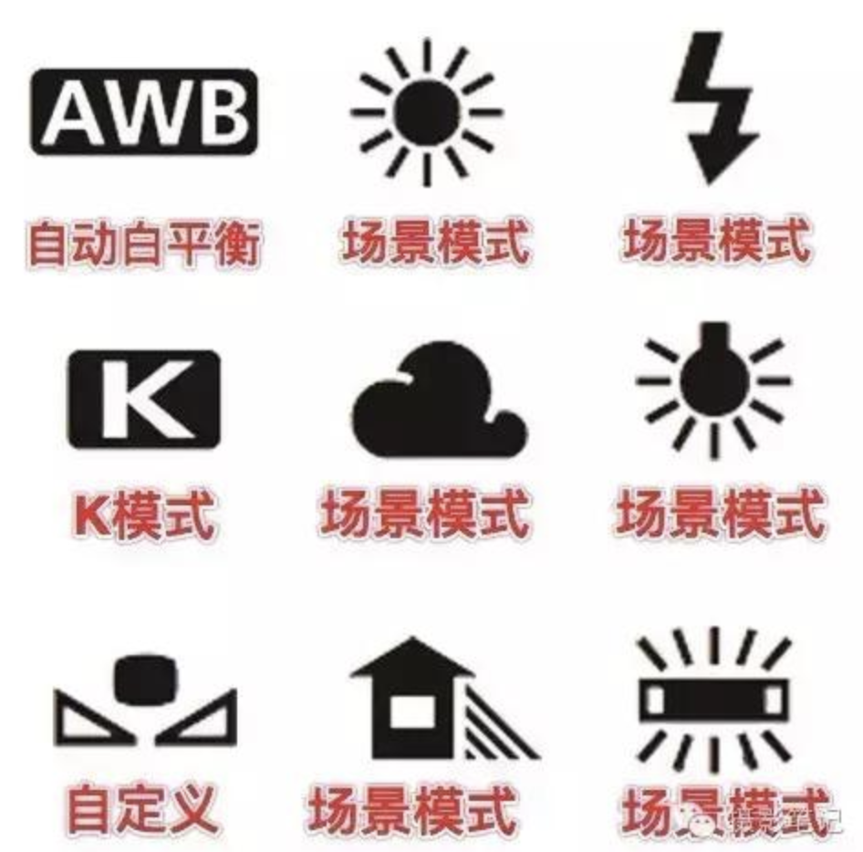
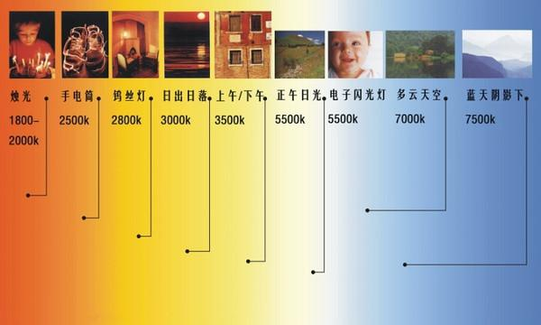

## 白平衡
白平衡(White Balance)，指的是在任何拍摄场景的光源下，都能将白色的物体还原为白色。相机的白平衡控制，就是相机在不同的光线环境中把白色的物体拍出来的相片尽可能还原为标准的白色，其实就是为了使相片不发生偏色的过程。

颜色并不是一个实实在在的东西，它只是我们大脑和视网膜处理的结果。我们的视觉系统有一个特殊的功能就是在光源变化的情况下，依然能够确定物体的真实颜色，这种鲁棒性是计算机所不具有的。

色彩的恒常性，也就可以简单的理解为，在外界光源变化的情况下，依然能够保留物体原始的色彩。我们研究色彩恒常性，提出各种算法，目的就是让计算机也具有人类视觉系统在外界光照变化的情况下还原物体真实颜色的特殊能力。

# **1、白平衡概述**
白平衡对相片的颜色效果起着非常重要的作用，不同的白平衡模式，在同一场景下相片的颜色效果相差还是很大的。如图：

图1：不同的白平衡对比效果差别很大

在拍摄过程当中，我们有时会拍到颜色不对的相片，比如有时拍出的相片会比较偏黄或者偏蓝的情况，这是由于在不同的光线下相机侦测色温时所产生不同色彩的问题。每一种光源都有它自已的颜色，从红色到蓝色各有不同。比如烛光、火堆、落日的光线会使画面偏橘黄色，这种色彩一般属于“暖色调”；而蓝色的天空则会让画面呈现出蓝色，或者其它呈现出蓝色色彩的物体，这种色彩属于“冷色调”；这种反映出冷暖色调的状态称之为色温，单位以Kelvin (K) 表示，平时看到的2000K~3000K等，这种数值就是色温的表示方式。它是由19世纪末英国物理学家洛德·凯尔文制定出了一整套色温计算法而创立，此后便以其名为单位了，就是K（开尔文温度）。

# **2、白平衡与色温的关系**
白平衡和色温是两个不同的概念，但它们有着千丝万缕的关系。**白平衡是通过调节色温来实现色彩的变化**，色温对于数码相机而言就是白平衡的问题，彼此有着密切联系。

### **2.1 色温是什么？**
与大家认知不同，传统我们认为蓝色是冷色，红色是暖色。其实学习白平衡就一定要把这个观念摒弃，同时认知一个新的概念——色温，单位是K（开尔文）。初中物理讲了零下273.15摄氏度被我们成为绝对零度，这就是0K。然后温度每上升1摄氏度，也就是上升1K。说白了，我们平时说的0摄氏度就是273.15K。开水是100摄氏度，那就是373.15K。

好，先普及了热力学温度的单位。也就是色温所用的单位，我们讲讲天文的事儿。

我们想象一个不发光的黑色的物体—绝对黑体。当我们把它加热之后，随着温度的升高，绝对黑体会先发出红光，随后越来越亮，变成黄光，再变成白光，直至蓝光。这个我们可以发现与天文有些关系。天上有很多星星，除了我们能够看到的水星、金星、月亮、火星、木星、土星外，基本上能看到的星星都是恒星——自己发光发热的星球。红色的星球表面温度低，蓝色的星球表面温度高。比如猎户座α——参宿四，这就是一颗很明亮的红巨星。红巨星的红就说明了这个星球表面温度并不高——只有3500K。而猎户座β——参宿七，一颗明亮的蓝巨星，表面温度可以达到11300K。可见蓝色温度比红色高。

图2：Betelgeuse就是参宿四，Rigel就是参宿七

我们最熟悉的太阳，表面温度5500K。在晴朗天气正午太阳的照耀下，一张白纸如果我们用相机拍摄的话，就是白色，很正的白色。如果我们将太阳换成参宿四，那么这张白纸会被参宿四的红色照耀成红纸。如果我们再换成参宿七，我们会发现这张白纸又会被这颗蓝巨星照耀成蓝纸。

所以我们得到这样一个结论，红色，是表面温度低的星球发出的光的颜色。而蓝色，是表面温度高的星球发出的光的颜色。颜色越红，色温越低，颜色越蓝，色温越高。

图3-1：这是低环境色温，红，暖色系

图3-2：这是高环境色温，蓝，冷色系

**红色是暖色，但是色温低；蓝色是冷色，但是色温高。**

### 2.2 不同的色温会如何呢？
上面说了，如果我们将太阳换成参宿四，那么这张白纸会被参宿四的红色照耀成红纸。如果我们再换成参宿七，我们会发现这张白纸又会被这颗蓝巨星照耀成蓝纸。

不管是红或者是蓝，都偏色了。

你觉得一张纸无所谓，那么如果是你女朋友呢？白白净净的姑娘，在参宿四下面被拍摄成了关公，在参宿七下呗拍摄成窦尔敦？一会儿大红脸，一会儿大蓝脸。这个不合适吧。所以我们要使用一个相机的功能。

## **2.3 相机白平衡**
白平衡的初始技能就是将在不同环境色温中的白色物体都还原成真的白色。

图4：相机白平衡

### **2.3.1 K模式**
很多相机白平衡选项中都有一个字母K的选项。就是当在K这个选项是，你可以手动调节色温的数值，这个K就是单位（开尔文）。如果你遇到红巨星参宿四作为光源，就要将K调节到3500K，如果遇到蓝巨星参宿七作为光源的时候，就要将K调节到11300K。

当你遇到蜡烛作为光源的时候……

你会发现一个问题，除非你知道环境色温到底是多少，你才能调节。要不然K这个选项相当不好用。

### **2.3.2 场景模式**
因为知道你不知道周围的环境色温，所以相机内部一般都预设了很多场景。比如云彩的图标表示多云，比如房子图标表示阴影，再比如灯泡的图标表示白炽灯。

你所在的环境是哪种，就在白平衡选项里选择哪种场景，一般来说都差不多。

### **2.3.3 自定义白平衡**
数码相机里都有自定义白平衡功能，在白平衡选项里的图标就是两个直角三角形最小锐角相对，上面还有一个小方块，看起来很像一朵抽象的花的那个。自定义白平衡的原理就是，找一个白色的东西，给相机看看，说：告诉你，这玩意在这个环境色温里变成的这个破色（shar），但是这个是白的，给我拍白咯！

相机就会以这个白色的物体作为基准白色，其它任何在这个环境色温中物体的颜色就都校正过来了。这个理论上是最精准的。所以很多摄影师包包里会带着一张白卡，就是为了可能会遇到自定义白平衡的情况。

### **2.3.4 自动白平衡(AWB)**
不管是K，还是场景模式，还是自定义白平衡，你发现都还挺难的。调来调去，哪天忘了调回来可能会给下次拍摄造成很大困扰。我是一个比较懒的人，所以我一般都选择AWB。

AWB就是AUTO WHITE BALANCE，自动白平衡。相机会根据环境判断在这个场景中环境色温大概是多少，然后设定色温，尽量将白色还原成白色。好处就是特别方便，因为一切都是自动的。坏处就是遇到色温特高或者特别低的时候，总会不准。

### **2.3.5 巧用白平衡**
你对于白平衡以及色温的了解是不是反了？

当日出日落时分，天红彤彤的，这时候环境色温低！所以你将相机的色温调节低——比如在K模式下调节到2500K。那么相机就知道，原来环境光比较“红”，相机需要往里面加“蓝”，这样才能将被红太阳映成红色的东西恢复其本来的颜色。所以如果你在一个本身就是白色光的地方，调节到K模式2500K——低色温，相机还是会以为这里很“红”，往里面加“蓝”。结果这个本身就是白色光的地方，居然就变成了蓝色的场景，表现出高色温。

* **其实我们可以巧用白平衡**

如果我们在拍摄日落的时候，我们觉得太阳和天空不够红，怎么办？我们可以欺骗相机。设置一个比较高的K值。相机看到你设置了一个比较高的K值，以为这地方色温高，会很努力往画面中添加红色来中和，结果……更红了。

图5-1：巧用白平衡1

如果你想表达一个很寒冷的感觉，你同样可以欺骗相机，设置一个比较低的K值。相机看到你设置了一个比较低的K值，以为这地方色温低，会很努力往画面中添加蓝色来中和，结果……更蓝了。

图5-2：巧用白平衡2

比5500K更低的K值，就开始让画面变蓝，比5500K更高的色温，就开始让画面变红。

# **3、色温的冷暖色调表现出的场景效果**
不同环境的色温值呈现出不同的画面效果，所表达出的氛围效果也是不一样的。下面我们例举色温值的范围表达的氛围效果：

* 当色温在＜3300K，场景的颜色表现出偏红的效果，属于暖色调，具有温暖稳重的氛围效果；
* 当色温在3300K-5000K，属于中间色调（白），具有爽快明朗的氛围效果；
* 当色温在＞5000K，场景的颜色表现出偏蓝的效果，属于冷色调，具有冷的氛围效果。

不同场景的色温值如下图:

图6：色温对照表

我们只有分清了色温值范围所属的色调以及带来的氛围效果，把握好色温的调节，才能有利于在拍摄作品过程中，创作出更有意境的相片。这个色温值可以通过相机调节设置，相机当中不仅有设置调节色温值功能，而且还设置了多种模式的白平衡，多种模式的白平衡其实就是代表色温值的效果。

# 4、相机的自动白平衡
彩色相机内部有三个CCD电子耦合元件，分别用来感受红/绿/蓝三中颜色的光线，默认情况下，三个颜色的感光电路信号的放大比例是1:1:1的。在理想的拍摄环境下，纯白色的RGB分量按照1:1:1的比例放大之后，得到的是没有偏色的白色，当在非理想的环境光条件下，白色成像出来的效果会偏向环境光的颜色，而不是纯白色。

**【相机的自动白平衡就是要通过改变RGB感光电路信号的放大比例，让受环境光影响的白色还原成纯白色，保证在各种光线条件下，成像色彩跟物体真实的色彩保持一致。】**

# 5、自动白平衡算法
人的视觉系统具有颜色恒常性，能从变化的光照环境和成像条件下获取物体表面颜色的不变特性，但成像设备不具有这样的调节功能，不同的光照环境会导致采集的图像颜色与真实颜色存在一定程度的偏差，需要选择合适的颜色平衡（校正）算法，消除光照环境对颜色显现的影响。
### 5.1、Gray World
### 5.2、Simplest Color Balance
### 5.3  Robust Auto White
### 5.4 White Patch Retinex

# 6、reference
* [https://blog.csdn.net/yapingmcu/article/details/50637797](https://blog.csdn.net/yapingmcu/article/details/50637797)
* [https://www.toutiao.com/a6624456772507664903/](https://www.toutiao.com/a6624456772507664903/)
* [https://blog.csdn.net/u012736685/article/details/50730784](https://blog.csdn.net/u012736685/article/details/50730784)
* [https://blog.csdn.net/carson2005/article/details/9502053](https://blog.csdn.net/carson2005/article/details/9502053) 

