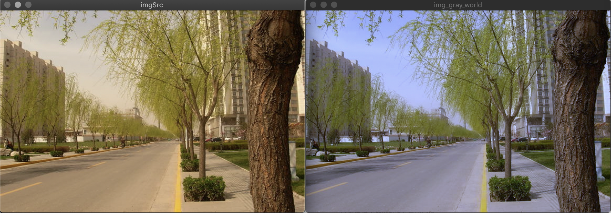

## 2、自动白平衡算法：Gray World（灰度世界）
### 1、概述
灰度世界算法（Gray World)是以灰度世界假设为基础的,该假设认为对于一幅有着大量色彩变化的图像, R、 G、 B 三个分量的平均值趋于同一个灰度K。从物理意义上讲，灰色世界法假设自然界景物对于光线的平均反射的均值在总体上是个定值，这个定值近似地为“灰色”。 颜色平衡算法将这一假设强制应用于待处理图像，可以从图像中消除环境光的影响，获得原始场景图像。一般有两种方法来确定该灰度： 

* 直接给定为固定值, 取其各通道最大值的一半，即取为127或128； 
* 令 $K = \frac{Raver+Gaver+Baver}{3}$，其中 $Raver,Gaver,Baver$ 分别表示红、 绿、 蓝三个通道的平均值。 

算法的第二步是分别计算各通道的增益： 
$$
Kr = \frac{K}{Raver}\\ 
Kg = \frac{K}{Gaver}\\
Kb = \frac{K}{Baver}\\
$$
算法第三步为根据**Von Kries 对角模型**，对于图像中的每个像素R、G、B，计算其结果值： 
$$
Rnew = R * Kr\\
Gnew = G * Kg\\
Bnew = B * Kb\\
$$

> 对于上式，计算中可能会存在溢出（>255,不会出现小于0的)现象，处理方式有两种：
>
> * a、 直接将像素设置为255，这可能会造成图像整体偏白。 
> * b、 计算所有Rnew、Gnew、Bnew的最大值，然后利用该最大值将将计算后数据重新线性映射到[0,255]内。
>
>实践证明第二种方式将会使图像整体偏暗，建议采用第一种方案。 

灰度世界算法简单快速，但是当图像场景颜色并不丰富时，尤其出现大块单色物体时，该算法常会失效。

### 2、**Von Kries 对角模型**
Von Kries提出，可用一个对角矩阵变换描述两种光照条件下同一物体表面颜色间的关系。假定在光照$E_1(\lambda),E_2(\lambda)$ 下感知到的物体 $R, G, B$ 值分别为$(P_r^1, P_g^1, P_b^1)、(P_r^2, P_g^2, P_b^2)$  ， 根据Von Kries对角理论有：
$$
\begin{bmatrix}
P_r^2\\
P_g^2\\
P_b^2\\
\end{bmatrix} = D\ *\ 
\begin{bmatrix}
P_r^1\\
P_g^1\\
P_b^1\\
\end{bmatrix} = 
\begin{bmatrix}
{K_r, 0, 0}\\
{0, K_g, 0}\\
{0, 0, K_b}\\
\end{bmatrix} * 
\begin{bmatrix}
P_r^1\\
P_g^1\\
P_b^1\\
\end{bmatrix}
$$

**该理论实现不同光源间的转换。**

### **3、代码**

	Mat grayWorld(Mat srcImg){
	    vector<Mat> imageRGB;
	
	    //RGB三通道分离
	    split(srcImg, imageRGB);
	
	    //求原始图像的RGB分量的均值
	    double R, G, B;
	    B = mean(imageRGB[0])[0];
	    G = mean(imageRGB[1])[0];
	    R = mean(imageRGB[2])[0];
	
	    //需要调整的RGB分量的增益
	    double KR, KG, KB;
	    KB = (R + G + B) / (3 * B);
	    KG = (R + G + B) / (3 * G);
	    KR = (R + G + B) / (3 * R);
	
	    //调整RGB三个通道各自的值
	    imageRGB[0] = imageRGB[0] * KB;
	    imageRGB[1] = imageRGB[1] * KG;
	    imageRGB[2] = imageRGB[2] * KR;
	
	    //RGB三通道图像合并
	    merge(imageRGB, srcImg);
	    return srcImg ;
	}
	
输出结果：

