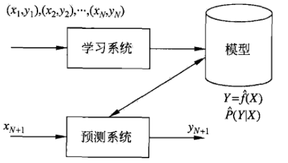

## 机器学习概述
### 0、推荐书籍
* 李航 -- 《统计学习方法》
* 周志华 -- 《机器学习》

相关文章和书籍的pdf版本放在【./files】中

### 1、什么是机器学习
#### 1.1、机器学习的定义
定义1
> 机器学习是这样一门学科，它致力于研究如何通过计算的手段，利用经验来改善系统自身的性能。在计算机系统中，"经验"通常以"数据"形式存在，因此，机器学习所研究的主要内容，是关于在计算机上从数据中产生"模型" (model) 的算法，即"学习算法" (learning algorithm)。有了学习算法，我们把经验数据提供给它，它就能基于这些数据产生模型;在面对新的情况时(例如看到一个没剖开的西瓜)，模型会给我们提供相应的判断(例如好瓜)。如果说计算机科学是研究关于"算法"的学问，那么类似的，可以说机器学习是研究关于"学习算法"的学问。【周志华《机器学习》】

定义2
> 统计学习也称为统计机器学习(statistical machine learning)，是关于计算机基于数据构建统计模型并运用模型对数据进行预测与分析的一门学科。【李航《统计学习方法》】

定义3
> 如果说“学习“是指一个系统能通过执行某个过程改进它的性能，那么统计学习就是计算机系统通过运用数据及统计方法提高系统性能的机器学习。***现在，当人们提及机器学习时，往往指统计机器学习。***【李航《统计学习方法》】

#### 1.2、机器学习的对象
机器学习的对象是数据。机器学习从数据出发，提取数据的特征，抽象出数据的模型，发现数据中的知识，又回到对数据的分析与预测中去。

数据是多样的，包括存储于计算机和网络中的一切数字信息，比如数字、文字、图像、视频、音乐声音以及它们的组合。

机器学习有一个前提，即数据具有一定的统计规律性，可以用随机变量描述数据的特征，用概率分布描述统计规律。

#### 1.3、机器学习的目的
机器学习的目的是对数据进行预测和分析，换句话说就是回归和分类，分别对应着连续和离散的数据类型。

#### 1.4、机器学习的方法
* 监督学习（supervised learning）
* 非监督学习（unsupervised learning）
* 半监督学习（semi-supervised learning）
* 强化学习（reinforcement learning）

**这里我们只讨论监督学习**，那么机器学习的方法可以概括如下：从给定的、有限的、用于学习的训练数据（training data）集合出发，假设数据是独立同分布产生的；应用某个评价标准(evaluation data)，从假设空间中选取一个最优的模型，使它对已知数据和未知数据(test data)在给定的评价准则下有最优的预测；最优模型的选取由算法实现。

由上面的描述可以总结出机器学习的三要素：模型的假设空间、模型选择的准则、以及模型学习的算法，也即模型（model）、策略（strategy）和算法（algorithm）。

监督学习可以通俗的理解为：拿一大堆（很多）同一个主题的问题来问你，并且每个问题都有答案，你自己的答案和标准答案刚开始有一定的差距，于是你每一次都用这个差距来修正你的答案，一轮又一轮的鞭策，你的答案和标准答案慢慢的接近，直到几乎一致，你慢慢地就理解了这个主题的规律和方法。当一个没有标准答案的问题过来的时候，你用刚才摸索到的规律和方法就能很快的得到接近完美的答案了。

实现机器学习的步骤如下：

* （1）得到一个有限的训练数据集合；
* （2）确定包含所有可能的模型的假设空间，即学习模型的集合；
* （3）确定模型选择的准则，即学习的策略；
* （4）实现求解最优模型的算法，即学习方法；
* （5）通过学习方法选择最优模型；
* （6）利用学习的最优模型对新数据进行预测或者分析。

### 2、机器学习的基本概念

#### 2.1、输入空间、特征空间、输出空间

* 输入空间（input space）：输入的所有可能取值的集合；
* 输出空间（output space）：输出的所有可能取值的集合。

> 输入与输出空间可以是有限元素的集合，也可以是整个欧式空间，也可以是不同的空间，但通常输出空间远小于输入空间。

* 特征空间：每一个具体的输入是一个实例(instance)，通常由特征向量(feature vector)表示，所有特征向量存在的空间称之为特征空间(feature space)。特征空间的每一维都对应一个特征。

习惯上，输入变量和输出变量分别用大写字母 $X$ 和 $Y$ 表示，输入变量和输出变量的取值分别用小写字母x和y表示。

输入实例 $x_i$ 的特征向量记作：
$$x_i = (x_i^{(1)}, x_i^{(2)}, x_i^{(3)}, ..., x_i^{(n)})^T$$
$x_i^{(j)}$ 表示第 $i$ 个实例的 第 $j$ 个特征。

监督学习从训练数据集合中学习模型，对测试数据进行预测。训练数据由输入(或特征向量)与输出对组成，训练集通常表示为：
$$T = \{(x_1, y_1), (x_2, y_2), (x_3, y_3), ..., (x_n, y_n)\}$$
输入与输出对又称之为样本(sample)或者样本点。

输入$X$与输出$Y$有不同的数据类型，可以是连续的，也可以是离散的。人们根据输入与输出变量的不同类型，对预测任务给与了不同的名称：

* 回归问题：输入变量和输出变量均为连续变量的预测问题称之为回归问题；
* 输出变量为有限个离散变量的预测问题称之为分类问题；
* 输入变量和输出变量均为变量序列的预测问题称之为标注问题。

#### 2.2、假设空间
监督学习的目的在于学习一个由输入到输出的映射，这一映射由模型来表示，即学习的目的是找到最好的这样的模型。模型属于由输入空间到输出空间的映射的集合，这个集合就是假设空间(hypothesis space)，用 $F$ 表示，模型用 $f$ 表示。假设空间的确定意味着学习范围的确定。

假设空间就是一堆可能的模型，但是不知道哪一个是最优的模型。

监督学习的模型可以是概率模型或者非概率模型，由条件概率$P(Y|X)$或者决策函数(decision function) $Y = f(X)$ 表示，随具体的学习方法而定。

### 3、最优模型的选择策略
有了假设空间，那么机器学习按照什么策略来选择最优的模型呢？这里引入损失函数和风险函数的概念。损失函数度量模型一次预测的好坏，**风险函数度量平均意义下模型预测的好坏**。

#### 3.1、损失函数
监督学习问题是在假设空间 $F$ 中选取模型 $f$ 作为决策函数，对于给定的输入 $X$，由 $f(X)$给出相应的输出 $Y$，这个输出的预测值 $f(X)$ 与真实值 $Y$ 可能一致也可能不一致，用一个损失函数(loss function)或者代价函数(cost function)来度量预测错误的程度。损失函数是 $f(X)$ 和 $Y$ 的非负实值函数，记作$L(Y, f(X))$。

**损失函数越小，模型就越好。**

机器学习常用的损失函数有一下几种：

* （1）0-1损失函数：
$$
L(Y, f(X)) = 
\begin{cases}
1， Y \neq f(X),\\
0, Y = f(X)\\
\end{cases}
$$

* （2）平方损失函数：
$$L(Y, f(X)) =(Y - f(X))^2$$

* （3）绝对损失函数：
$$L(Y, f(X)) =|Y - f(X)|$$

* (4)对数损失函数：
$$L(Y, P(Y|X)) = -logP(Y|X)$$

#### 3.2、风险函数
由于模型的输入、输出 $(X, Y)$ 是随机变量，遵循联合分布 $P(X|Y)$，所以损失函数的期望是：
$$R_{exp}(f) = E_p[L(Y, f(X))] = \int_{x*y}L(y, f(x))P(x, y)dxdy$$
这是平均意义下的损失，称为风险函数(risk function)或者期望损失(expected loss)。

学习的目标是选择期望风险最小的模型。

遗憾的是，由于联合分布 $P(X|Y)$ 是未知的，$R_{exp}(f)$ 不能够直接的计算，这样一来，一方面根据期望风险最小学习模型用到联合分布，另一方面联合分布又是未知的，所以监督学习就成为了一个病态问题(ill-formed problem)。

给定一个训练数据集$$T = \{(x_1, y_1), (x_2, y_2), (x_3, y_3), ..., (x_n, y_n)\}$$ 模型 $f(X)$ 关于训练数据集的平均损失称之为经验风险(empirical risk)或者经验损失(empirical loss)，记作$R_{emp}$:$$R_{emp}=\frac{1}{N}\sum_{i=1}^{N}L(y_i, f(x_i))$$根据大数定律，当样本容量 $N$ 趋于无穷时，经验风险 $R_{emp}$ 趋近于期望风险 $R_{exp}$ 。所以很自然的想法是用经验风险估计期望风险。

但是，现实中训练样本数目有限，甚至很小。

经验风险最小化的策略认为，经验分享最小的模型是最优的模型，按照经验风险最小化求最优模型就是求解最优化问题：$$\min_{f\in F}\frac{1}{N}\sum_{i=1}^{N}L(y_i, f(x_i))$$

